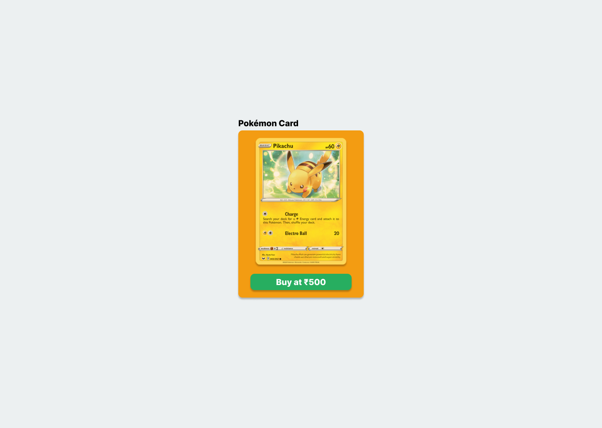
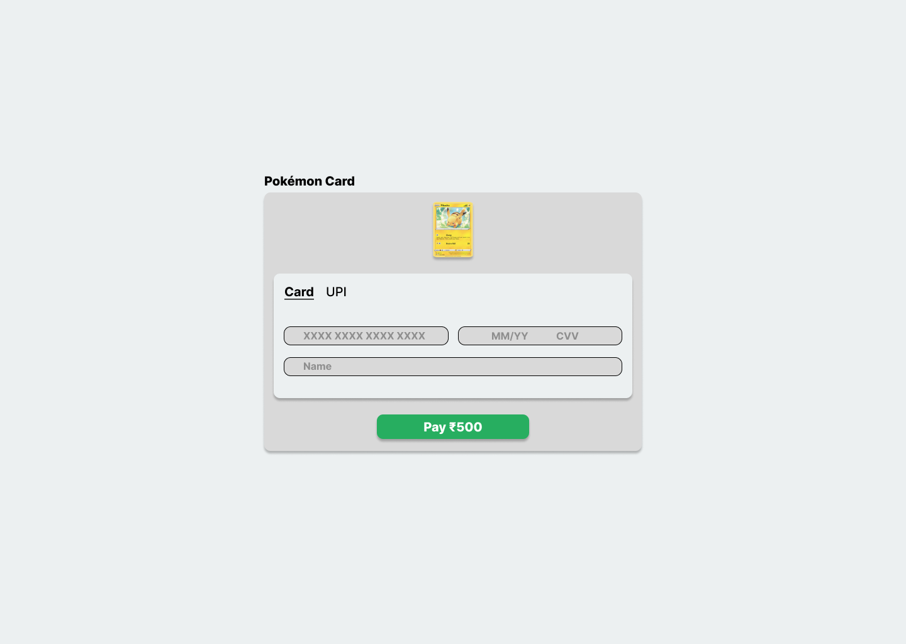
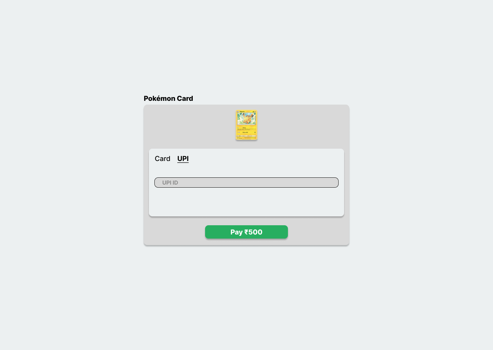
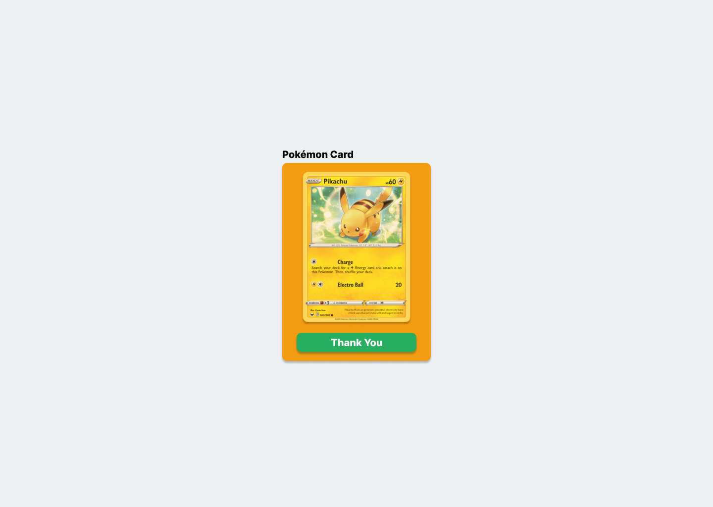

# Cashfree Checkout

Reference project to understand how to build a self hosted [Cashfree](https://www.cashfree.com) checkout page.

This is built using [SvelteJS](https://kit.svelte.dev/)

## Preview

Demo at [Google](https://google.com)

|  |  |
| --- | --- |
  |  
  |  


## Developing

```bash
# create a new project in my-app
npm create svelte@latest cashfree-custom-checkout

# install dependencies
npm i

# or start the server and open the app in a new browser tab
npm run dev -- --open
```

## Building

To create a production version of your app:

```bash
npm run build
```

You can preview the production build with `npm run preview`.

> To deploy your app, you may need to install an [adapter](https://kit.svelte.dev/docs/adapters) for your target environment.
